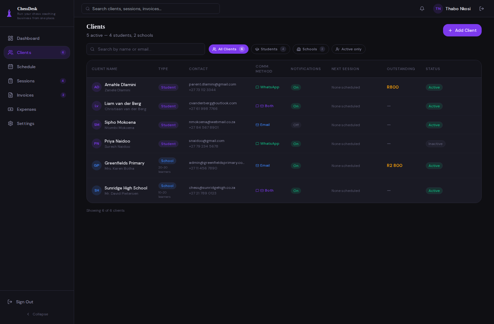
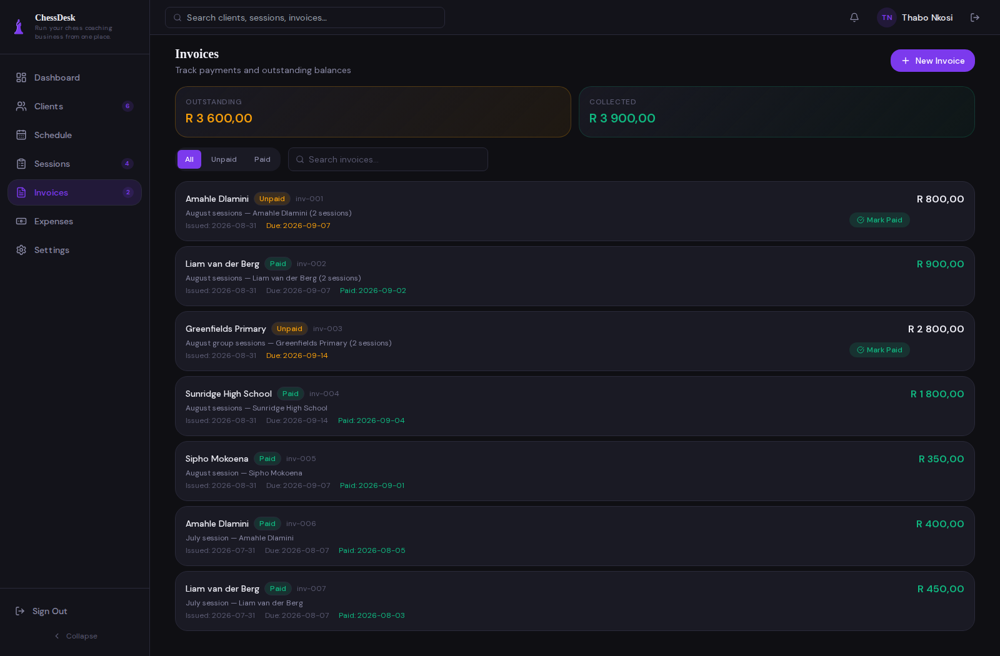

# ChessDesk

ChessDesk is a coaching-business workspace for independent chess coaches. It brings student and school records, lesson scheduling, invoices, expense tracking, and a financial overview into one app, so a coach can manage everyday operations without spreadsheets scattered across different tools.

The project is aimed at small coaching businesses in South Africa. It records business activity; it is not an accounting package, payment processor, chess-playing app, or chess engine.

## Demo

The repository includes synthetic coach, student, school, session, invoice, and expense records. These screenshots show the seeded local demo:

### Clients

Individual students and school clients share one searchable list, with contact preferences, notification settings, next-session information, outstanding balances, and active status.

### Invoices

Review paid and unpaid invoices, due dates, client balances, and collected totals in rand.

To sign in to the local demo, use:

- Email: **thabo@chessops.co.za**
- Password: **chess2026!**

This account and password are for local demonstration only. A fresh database is seeded by default; set <code>CHESSDESK_SEED_DEMO=false</code> for a hosted deployment.

## Features

- **Client records:** Manage individual students and school clients, including parent or school contacts, WhatsApp and email details, notification preferences, notes, and active status.
- **Session scheduling:** Schedule lessons for a student or school; record online or in-person format, location, duration, notes, and status; update, complete, cancel, or delete sessions.
- **Invoices and payments:** Create invoices associated with coaching work, track paid and unpaid amounts, and record payment dates, methods, and references.
- **Expense tracking:** Record business expenses by date, category, amount, and description.
- **Business dashboard:** View revenue, payments received, outstanding invoices, expenses, net income, activity, and sessions for the current month, previous month, or all time.
- **Coach accounts:** Sign up, sign in, update a business profile, and keep each account's coaching records isolated.
- **API and telemetry:** Explore the REST API through OpenAPI docs. The backend can export traces and metrics through OpenTelemetry to the included local observability stack.

Session changes can create notification records according to each client's preferences. The app does not currently connect to an email or WhatsApp delivery provider, so it does not send those messages.

## Run locally

### Prerequisites

- Python 3.11 or later and [uv](https://docs.astral.sh/uv/)
- Node.js 22 and npm
- Docker Compose is optional for local development and required for the containerized stack

### Start the API and frontend

In the repository root, install Python dependencies and start the API:

    uv sync
    make dev

In another terminal, start the frontend:

    cd frontend
    npm ci
    npm run dev

Open <http://localhost:4028>. The API listens at <http://localhost:8000>, and interactive API docs are at <http://localhost:8000/api/v1/docs>. By default the backend uses <code>sqlite:///./chessdesk.db</code> and seeds the demo records when the database is empty.

### Start the complete Docker stack

The root Compose project expects the shared observability network. Start the observability stack first; this creates the network as well:

    make observability-up
    docker compose up --build -d

Open the app at <http://localhost:8000>. Grafana is at <http://localhost:3000> with the local default login <code>admin</code> / <code>chessdesk-local</code>. The monitoring project can be stopped with <code>make observability-down</code>; its named data volumes are retained. Stop the application services with <code>docker compose down</code>.

## Configuration

| Variable | Default | Purpose |
| --- | --- | --- |
| <code>DATABASE_URL</code> | <code>sqlite:///./chessdesk.db</code> | SQLAlchemy database URL. Docker Compose configures PostgreSQL. |
| <code>CHESSDESK_SEED_DEMO</code> | <code>true</code> | Seed example records when the database has no coach. Disable for hosted deployments. |
| <code>CHESSDESK_COOKIE_SECURE</code> | <code>false</code> | Set <code>true</code> when serving over HTTPS so the session cookie is sent only over encrypted connections. |
| <code>OTEL_SERVICE_NAME</code> | <code>chessdesk-backend</code> | Override the OpenTelemetry service name. |
| <code>OTEL_RESOURCE_ATTRIBUTES</code> | development defaults | Set deployment environment and version resource attributes. |
| <code>OTEL_EXPORTER_OTLP_ENDPOINT</code> | unset outside Compose | OTLP collector endpoint. Compose defaults to <code>http://otel-collector:4317</code>. |
| <code>OTEL_EXPORTER_OTLP_PROTOCOL</code> | <code>grpc</code> | Set to <code>http/protobuf</code> to export over OTLP HTTP. |
| <code>OTEL_TRACES_EXPORTER</code> / <code>OTEL_METRICS_EXPORTER</code> | <code>otlp</code> in Compose | Set either signal to <code>none</code> to disable it; <code>console</code> is available for local inspection. |
| <code>NEXT_PUBLIC_API_BASE_URL</code> | <code>http://localhost:8000/api/v1</code> in development | Override the frontend API URL at build time when hosting the frontend separately. |

The API also answers <code>GET /health</code>. See [backend setup notes](backend/README.md) and the [observability guide](observability/README.md) for standalone database and telemetry configuration.

## Architecture

The browser runs the Next.js frontend. It calls the FastAPI REST API, which authenticates the coach and reads or writes application records through SQLAlchemy. The backend uses SQLite for a simple local run and PostgreSQL in Docker Compose.

When telemetry is enabled, FastAPI and SQLAlchemy instrumentation export traces and metrics over OTLP. The included stack routes traces to Tempo, metrics to Prometheus, and provides Grafana dashboards. Loki is included for log storage, but the application does not currently export OTLP logs.

    Browser → Next.js 15 frontend → FastAPI API → SQLAlchemy → SQLite or PostgreSQL
    FastAPI and SQLAlchemy → OpenTelemetry Collector → Prometheus and Tempo → Grafana

## Technology

| Area | Tools |
| --- | --- |
| Frontend | Next.js 15, React 19, TypeScript, Tailwind CSS, Recharts |
| Backend | Python 3.11+, FastAPI, Pydantic, SQLAlchemy |
| Data | SQLite for local development; PostgreSQL 16 in Compose |
| Observability | OpenTelemetry, Collector, Prometheus, Tempo, Loki, Grafana |
| Deployment | Docker, AWS CloudFormation, EC2, CloudFront, ECR, GitHub Actions |

## Tests and CI

Run backend unit tests with:

    uv run pytest

Run frontend unit tests from the frontend directory:

    cd frontend
    npm ci
    npm test

Run HTTP integration tests against the Compose services with:

    make integration

Install the root Playwright dependencies and Chromium, then run the end-to-end workflow from the repository root:

    npm ci
    npx playwright install chromium
    make e2e

The GitHub Actions workflow runs backend tests, frontend tests, Compose integration tests, and Playwright end-to-end tests. On pushes to <code>main</code>, it then builds and deploys to the development environment. Production promotion is a separate manual workflow. See the [deployment guide](deploy/README.md).

## Deployment and operations

The AWS deployment uses separate development and production stacks. GitHub Actions deploys successful <code>main</code> builds to development; a manual workflow promotes the image running there to production. Deployment details, required AWS setup, and operator access are in [deploy/README.md](deploy/README.md).

The local observability stack and current metrics are described in [observability/README.md](observability/README.md). It includes a Grafana application metrics dashboard and an alert for repeated session-creation server errors.

## Limitations and next steps

- Session notification events are stored in the app's database; no real WhatsApp or email provider is integrated.
- Password-reset requests return the same accepted response for any address, but no reset email is sent.
- Dashboard charts and summaries use recorded business data; they do not provide accounting, tax, or payment processing.
- Demo seed sessions and invoices use fixed sample dates, so their upcoming-session and period summaries can become stale over time.
- There is no parent, learner, or school portal, team management, chess engine, or online game interface.

Integrating message delivery and a real password-reset flow are natural follow-up tasks. The [MVP specification](docs/spec.md) describes the original product scope.

## Repository topics

GitHub topics: <code>chess</code>, <code>chess-coaching</code>, <code>coaching-management</code>, <code>business-management</code>, <code>fastapi</code>, <code>nextjs</code>, <code>typescript</code>, <code>postgresql</code>, <code>opentelemetry</code>, and <code>aws</code>.

## Releases

The current release is [v0.1.0](https://github.com/Eleazarovich/chessdesk/releases/tag/v0.1.0). Read the [v0.1.0 release notes](docs/releases/v0.1.0.md) or browse [all releases](https://github.com/Eleazarovich/chessdesk/releases).

## Author

[Eleazar Nhamuave](https://github.com/Eleazarovich) is a software engineer in Gauteng, South Africa. Profile bio: “Software Engineer | Python & Java | Turning Manual Processes into Code.”

## Project layout

    backend/                 FastAPI application, SQLAlchemy store, and backend tests
    frontend/src/app/         Next.js pages for dashboard, clients, schedule, sessions, invoices, and expenses
    frontend/src/lib/         API client, types, date helpers, and frontend services
    observability/            Local Compose stack, Grafana dashboard, and alert rules
    deploy/                   AWS CloudFormation and deployment instructions
    integration_tests/        HTTP integration tests for the Compose stack
    e2e/                      Playwright business-workflow test
    docs/spec.md              Product MVP specification
    openapi.yaml              API contract
